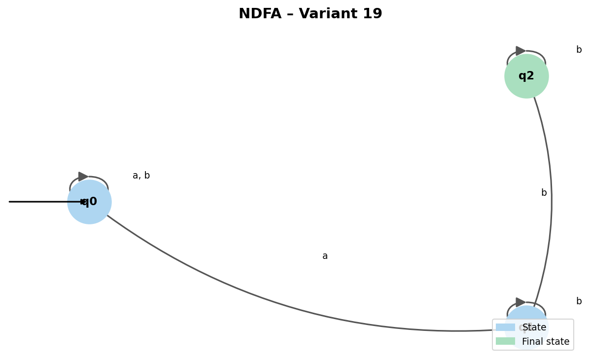
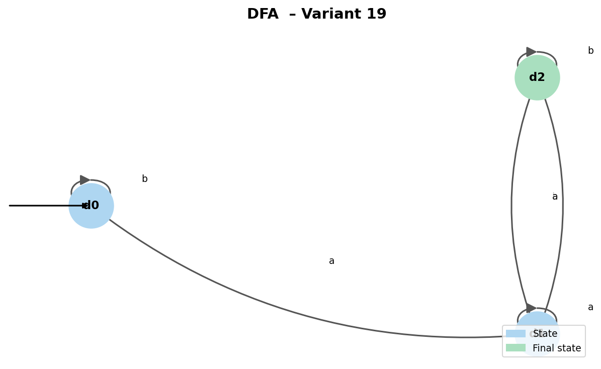

# Lab 2 – Determinism in Finite Automata

**Course:** Formal Languages & Finite Automata
**Author:** Iulian Pavlov

---

## Table of Contents

1. [Overview](#overview)
2. [Variant 19 – FA Definition](#variant-19--fa-definition)
3. [Chomsky Hierarchy Classification](#chomsky-hierarchy-classification)
4. [FA → Regular Grammar Conversion](#fa--regular-grammar-conversion)
5. [Determinism Check](#determinism-check)
6. [NDFA → DFA Conversion](#ndfa--dfa-conversion)
7. [Graphical Representation](#graphical-representation)
8. [Implementation](#implementation)
9. [Testing](#testing)
10. [Challenges Encountered](#challenges-encountered)
11. [Conclusions](#conclusions)

---

## Overview

This lab extends the work from Lab 1 by focusing on **determinism** in finite automata and the Chomsky grammar hierarchy. A finite automaton is *deterministic* (DFA) when every (state, symbol) pair leads to at most one next state. When multiple next states are possible from the same pair, the automaton is *non-deterministic* (NDFA).

The lab covers four concrete tasks:

1. Classify a grammar according to the Chomsky hierarchy.
2. Convert an FA to a regular grammar.
3. Determine whether the FA is deterministic or non-deterministic.
4. Convert the NDFA to an equivalent DFA using the subset construction.

---

## Variant 19 – FA Definition

```
Q  = {q0, q1, q2}
Σ  = {a, b}
F  = {q2}

δ(q0, a) = q1
δ(q0, a) = q0      ← same symbol, two targets → NDFA
δ(q1, b) = q2
δ(q0, b) = q0
δ(q1, b) = q1
δ(q2, b) = q2
```

Because two rules share the same left-hand side `(q0, a)`, the transitions are merged into:

| State | Symbol | Next states    |
|-------|--------|----------------|
| q0    | a      | {q0, q1}       |
| q0    | b      | {q0}           |
| q1    | b      | {q1, q2}       |
| q2    | b      | {q2}           |

The language accepted is all strings over `{a, b}` that contain **at least one `a`** followed **at some later point** by at least one `b` — more precisely, strings matching `(a|b)*a(b|ab)*b`.

---

## Chomsky Hierarchy Classification

The Chomsky hierarchy divides formal grammars into four types based on the shape of their production rules:

| Type | Name               | Production constraint                    |
|------|--------------------|------------------------------------------|
| 0    | Unrestricted       | No restriction                           |
| 1    | Context-Sensitive  | \|lhs\| ≤ \|rhs\| for all rules          |
| 2    | Context-Free       | Single non-terminal on LHS               |
| 3    | Regular            | A → a  or  A → aB  (right/left-linear)   |

The `Grammar.classify()` method tests from the most restrictive type downwards:

```python
def classify(self) -> str:
    if self._is_type3():
        return "Type 3 (Regular)"
    if self._is_type2():
        return "Type 2 (Context-Free)"
    if self._is_type1():
        return "Type 1 (Context-Sensitive)"
    return "Type 0 (Unrestricted)"
```

Classification examples used in the demo:

| Example grammar              | Result                   |
|------------------------------|--------------------------|
| `S → aA, A → bS \| b`        | Type 3 (Regular)         |
| `S → aSb \| ab`              | Type 2 (Context-Free)    |
| `Ab → bA, aB → aa, …`        | Type 1 (Context-Sensitive)|
| `SA → a`                     | Type 0 (Unrestricted)    |

---

## FA → Regular Grammar Conversion

### Conversion Rules

Each state becomes a non-terminal (capitalised). For every transition `δ(q, a) ∋ p`:

- Add production `Q → aP` (move to another state)
- If `p` is a final state, also add `Q → a` (string may end here)
- If the start state itself is final, add `S → ε`

### Resulting Grammar

Applying the rules to Variant 19:

```
Non-terminals : {Q0, Q1, Q2}
Terminals     : {a, b}
Start symbol  : Q0

Productions:
  Q0 → aQ0        (δ(q0, a) ∋ q0)
  Q0 → aQ1        (δ(q0, a) ∋ q1)
  Q0 → bQ0        (δ(q0, b) = q0)
  Q1 → bQ1        (δ(q1, b) ∋ q1)
  Q1 → bQ2        (δ(q1, b) ∋ q2)
  Q1 → b          (q2 is final, so also add terminal-only rule)
  Q2 → bQ2        (δ(q2, b) = q2)
  Q2 → b          (q2 is final)
```

All LHS symbols are single non-terminals and every RHS is of the form `aB` or `a`, so this grammar classifies as **Type 3 (Regular)**, which is consistent — a grammar derived from a finite automaton must always be regular.

---

## Determinism Check

An FA is **deterministic** if and only if:

1. No ε-transitions exist.
2. For every (state, symbol) pair, at most one next state exists.

Variant 19 fails condition 2 in two places:

```
δ(q0, a) = {q0, q1}   ← two targets
δ(q1, b) = {q1, q2}   ← two targets
```

Therefore the FA is **NON-DETERMINISTIC (NDFA)**.

The check in code:

```python
def is_deterministic(self) -> bool:
    for (state, symbol), next_states in self.transitions.items():
        if symbol == "ε":
            return False
        if len(next_states) > 1:
            return False
    return True
```

---

## NDFA → DFA Conversion

### Algorithm — Subset Construction (Powerset Construction)

The key idea: each DFA state represents a **set of NDFA states** that the machine could simultaneously be in.

**Steps:**

1. Start with the DFA start state `{q0}`.
2. For each unprocessed DFA state and each symbol, compute the union of all NDFA transitions from every state in the set.
3. The resulting set becomes a new DFA state. Mark it as final if it contains any NDFA final state.
4. Repeat until no new states are discovered.

### Conversion Trace

| DFA state | Represents   | On `a`      | On `b`      | Final? |
|-----------|--------------|-------------|-------------|--------|
| d0        | {q0}         | {q0, q1}→d1 | {q0}→d0     | No     |
| d1        | {q0, q1}     | {q0, q1}→d1 | {q0,q1,q2}→d2 | No   |
| d2        | {q0, q1, q2} | {q0, q1}→d1 | {q0,q1,q2}→d2 | **Yes** |

### Resulting DFA

```
States       : {d0, d1, d2}
Alphabet     : {a, b}
Start        : d0
Final states : {d2}

Transitions:
  δ(d0, a) = d1
  δ(d0, b) = d0
  δ(d1, a) = d1
  δ(d1, b) = d2
  δ(d2, a) = d1
  δ(d2, b) = d2
```

The DFA is verified deterministic — every (state, symbol) pair maps to exactly one state.

---

## Graphical Representation

### NDFA – Variant 19



- **Blue nodes** — regular states
- **Green nodes** — final states (accepting)
- The arrow with no source points to the start state `q0`

### DFA – Variant 19 (after conversion)



The DFA has the same number of states as the NDFA in this case because many subset combinations were unreachable or collapsed.

---

## Implementation

### Project Structure

```
lab2/
├── main.py                    — entry point; Variant 19 definition + task runners
├── grammar/
│   ├── __init__.py
│   └── grammar.py             — Grammar class + Chomsky hierarchy classifier
├── automaton/
│   ├── __init__.py
│   └── finite_automaton.py    — FiniteAutomaton class (all FA logic)
└── utils/
    ├── __init__.py
    └── visualiser.py          — PNG diagram renderer (matplotlib + networkx)
```

### Grammar Class — `grammar/grammar.py`

Stores `(V_N, V_T, P, S)` and provides `classify()` which checks rules bottom-up from Type 3 to Type 0. The key helper methods:

```python
def _is_right_linear(self, rhs: str) -> bool:
    # Accepts: ε | t | t·NT  (t ∈ terminals, NT ∈ non_terminals)
    if rhs == "ε":
        return True
    for t in self.terminals:
        if rhs == t:
            return True
        if rhs.startswith(t) and rhs[len(t):] in self.non_terminals:
            return True
    return False
```

Non-terminal names can be multi-character (e.g. `Q0`, `Q1`) so the check iterates over terminal strings rather than assuming single characters.

### FiniteAutomaton Class — `automaton/finite_automaton.py`

Transitions are stored as `dict[tuple[str,str], set[str]]` to naturally represent both DFA and NDFA in one structure.

**FA → Regular Grammar**

```python
def to_regular_grammar(self) -> Grammar:
    state_to_nt = {s: s[0].upper() + s[1:] for s in sorted(self.states)}
    productions = {nt: [] for nt in state_to_nt.values()}

    for (state, symbol), next_states in self.transitions.items():
        nt = state_to_nt[state]
        for next_state in next_states:
            next_nt = state_to_nt[next_state]
            productions[nt].append(f"{symbol}{next_nt}")   # Q → aP
            if next_state in self.final_states:
                productions[nt].append(symbol)              # Q → a

    return Grammar(state_to_nt.values(), self.alphabet, productions,
                   state_to_nt[self.start])
```

**NDFA → DFA (subset construction)**

```python
def to_dfa(self) -> FiniteAutomaton:
    start_set = frozenset({self.start})
    worklist = [start_set]
    visited = set()
    dfa_transitions = {}

    while worklist:
        current = worklist.pop()
        if current in visited:
            continue
        visited.add(current)

        for symbol in sorted(self.alphabet):
            reachable = set()
            for ndfa_state in current:
                reachable |= self.transitions.get((ndfa_state, symbol), set())
            if not reachable:
                continue
            next_frozen = frozenset(reachable)
            dfa_transitions[(current, symbol)] = {next_frozen}
            if next_frozen not in visited:
                worklist.append(next_frozen)
    ...
```

### Visualiser — `utils/visualiser.py`

Uses `matplotlib` with the `Agg` (non-display) backend and `networkx` for graph layout. Requires no system binaries — only:

```bash
pip install matplotlib networkx
```

---

## Testing

### FA Determinism

| Check                          | Result              |
|--------------------------------|---------------------|
| δ(q0, a) has 2 targets         | NDFA confirmed      |
| δ(q1, b) has 2 targets         | NDFA confirmed      |
| After conversion, all DFA pairs| Single target each  |

### DFA Correctness — Sample Strings

| String   | Expected | DFA result | Trace summary                    |
|----------|----------|------------|----------------------------------|
| `ab`     | ACCEPT   | ✓ ACCEPT   | d0 →a d1 →b d2 (final)           |
| `aab`    | ACCEPT   | ✓ ACCEPT   | d0 →a d1 →a d1 →b d2 (final)     |
| `b`      | REJECT   | ✓ REJECT   | d0 →b d0 (not final)             |
| `abb`    | ACCEPT   | ✓ ACCEPT   | d0 →a d1 →b d2 →b d2 (final)     |
| `ba`     | REJECT   | ✓ REJECT   | d0 →b d0 →a d1 (not final)       |
| `aabb`   | ACCEPT   | ✓ ACCEPT   | d0 →a d1 →a d1 →b d2 →b d2      |

### Chomsky Classification

| Grammar         | Expected              | Result                |
|-----------------|-----------------------|-----------------------|
| Derived from FA | Type 3 (Regular)      | ✓ Type 3 (Regular)    |
| `S → aSb`       | Type 2 (Context-Free) | ✓ Type 2 (Context-Free)|
| `Ab → bA`       | Type 1 (Context-Sensitive) | ✓ Type 1         |
| `SA → a`        | Type 0 (Unrestricted) | ✓ Type 0 (Unrestricted)|

---

## Challenges Encountered

### Challenge 1 — Multi-character non-terminal names in grammar classification

The initial Type 3 check used `len(rhs) == 2 and rhs[1] in self.non_terminals` which assumed single-character non-terminal names. The grammar derived from the FA uses names like `Q0`, `Q1`, `Q2`, so `bQ1` has length 3 and the check failed silently, causing the grammar to be misclassified as Type 0.

The fix was to iterate over known terminal symbols and check whether the remaining suffix is a known non-terminal, regardless of length:

```python
for t in self.terminals:
    if rhs.startswith(t) and rhs[len(t):] in self.non_terminals:
        return True
```

A similar fix was applied to `_is_type3`, which also had a `len(lhs) != 1` guard that rejected multi-character non-terminals on the LHS.

### Challenge 2 — Rendering FA diagrams without system binaries

The first version of the visualiser used the `graphviz` Python package, which is only a thin wrapper around the `dot` command-line tool. On systems where the Graphviz binaries are not installed, no PNG is produced and the error message is cryptic.

The replacement uses `matplotlib` + `networkx`, both pure-Python packages installable with a single `pip install`. The `Agg` matplotlib backend allows saving PNGs without any display or GUI, making it work in headless environments too.

---

## Conclusions

This lab made the relationship between NDFAs and DFAs concrete. The subset construction is elegant: by treating sets of NDFA states as single DFA states, every non-deterministic choice is resolved without changing the accepted language. For Variant 19 the DFA ended up with the same number of states as the NDFA, which is a coincidence of the specific automaton — in general the DFA can have exponentially more states.

The Chomsky hierarchy classification reinforced that finite automata and regular grammars occupy the same level (Type 3), and any grammar derived from an FA will always be regular.

---

## References

- Course materials: Formal Languages & Finite Automata
- Hopcroft, Motwani, Ullman — *Introduction to Automata Theory, Languages, and Computation*
- networkx documentation: https://networkx.org
- matplotlib documentation: https://matplotlib.org
